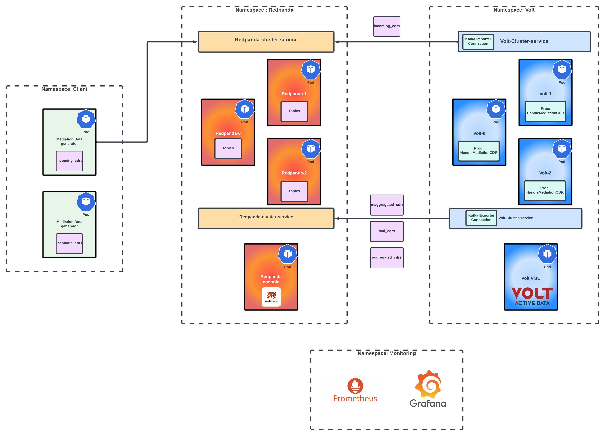

# k8s-volt-aggdemo
Mediation Aggregation demo on kubernetes

This setup is a kubernetes deployment of the following demo: [VoltDB-aggdemo](https://github.com/kjmadscience/voltdb-aggdemo)

### Components

- Google Kubernetes Engine [GKE](https://cloud.google.com/kubernetes-engine)
- Helm [v3](https://helm.sh/docs/intro/install/), Kubectl [v1.19 or later](https://kubernetes.io/docs/reference/kubectl/), Gcloud CLI [gcloud docs](https://cloud.google.com/sdk/docs/install)
- Volt Active Data [v11.4](https://docs.voltactivedata.com/v11docs/)
- Redpanda [v22.3.5](https://docs.redpanda.com/docs/deploy/deployment-option/self-hosted/kubernetes/kubernetes-production-deployment/)
- Mediation Data generator
- Prometheus
- Grafana

### Pre-requisites

1. Gcloud CLI, Helm and kubectl are properly configured on the user terminal from where these scripts will be executed. 

2. Access and license to Volt Active Data Helm Charts and enterprise docker images.

### Architecture Diagram



### Setup Environment

1. Change variables in **setup.sh** at the top of the file to desired values for your setup. 
Details about the variables are below,

| Variable | Description | Example |
| ----------- | ----------- | ----------- |
| CLUSTER_NAME | Name of kubernetes cluster that will be created in GKE | "volt-lab" |
| MACHINE_TYPE | Type of machine from GCP machine family for nodes of the kubernetes cluster | "c2-standard-8" |
| NUM_NODES | Number of nodes for the entire kubernetes cluster | "8" |
| DISK_SIZE | Disk size for each node of kubernetes cluster | "200" |
| ZONE | The zone for nodes in kubernetes cluster | "us-central1-c" | 
| K8S_CLUSTER_VERSION | K8S version used by GKE  | "1.22.17-gke.4300" |
| MONITORING_NS | Namespace for prometheus for volt and kube metrics monitoring | "monitoring" |
| VOLT_NS | Namespace for volt operator and pods | "volt" |
| CLIENT_NS | Namespace for traffic generator client | "client" |
| REDPANDA_NS | Namespace for redpanda pods | "redpanda" |
| DOCKER_ID | Username for Volt enterprise docker image access | "jdoeuname" |
| DOCKER_API | API token for Volt enterprise docker image access | "" |
| DOCKER_EMAIL | Email ID for Volt enterprise docker image access | "john@doe.com" |
| VOLT_DEPLPOYMENTNAME | helm deployment name for volt | "mydb" |
| PROPERTY_FILE | Property file for volt | "myproperties.yaml" |
| LICENSE_FILE | File path with name for Volt Enterprise license |
| RP_PROPERTY | Property file for redpanda | "red.yaml" |

2. Change Volt properties in **myproperties.yaml**
	- Resources (CPU, RAM)
	- Deployment properties (command logs, snapshots, kfactor, replicas)
	- Import, export broker details, change namespace according to your env.
	- Volumes

3. Change Redpanda properties in **red.yaml**
	- resources (CPU, RAM)
	- Volumes

4. For Redpanda console, verify properties in **console.yaml**
    - Brokers FQDN service name
    - Service type

5. Add helm repos (one time step)

Volt: `helm repo add voltdb https://voltdb-kubernetes-charts.storage.googleapis.com`

Redpanda: `helm repo add redpanda https://charts.redpanda.com `

6. Run **setup.sh**
The script will create GKE cluster, create namespaces, and deploy applications with properties defined in earlier step.

7. Verify installations

- Volt

```
$ kubectl get pods -n volt
NAME                                    READY   STATUS    RESTARTS  
mydb-voltdb-cluster-0                   1/1     Running   0         
mydb-voltdb-cluster-1                   1/1     Running   0         
mydb-voltdb-cluster-2                   1/1     Running   0         
mydb-voltdb-metrics-7cc489b675-2k9z4    1/1     Running   0         
mydb-voltdb-operator-7b7f6f59f8-njftp   1/1     Running   0         

$ kubectl get svc -n volt
NAME                           TYPE        CLUSTER-IP     EXTERNAL-IP   PORT(S)                                                  
mydb-voltdb-cluster-client     NodePort    10.36.13.184   <none>        21211:31211/TCP,21212:31212/TCP                          
mydb-voltdb-cluster-http       NodePort    10.36.4.214    <none>        8080:31080/TCP                                           
mydb-voltdb-cluster-internal   ClusterIP   None           <none>        8080/TCP,3021/TCP,7181/TCP,9090/TCP,11235/TCP,11780/TCP  
mydb-voltdb-metrics            ClusterIP   10.36.11.82    <none>        8484/TCP                                                 
voltdb-operator-metrics        ClusterIP   10.36.0.240    <none>        8383/TCP,8686/TCP                                        
```
- Redpanda
```
$ kubectl get pods -n redpanda
NAME                          READY   STATUS      RESTARTS 
redpanda-0                    1/1     Running     0        
redpanda-1                    1/1     Running     0        
redpanda-2                    1/1     Running     0        
redpanda-post-install-qxbnx   0/1     Completed   0        
rp-console-6d49576f4-d248m    1/1     Running     0        

$ kubectl get svc -n redpanda
NAME                TYPE        CLUSTER-IP     EXTERNAL-IP   PORT(S)                                                       
redpanda            ClusterIP   None           <none>        <none>                                                        
redpanda-external   NodePort    10.36.6.220    <none>        9644:31644/TCP,9094:31092/TCP,8083:30082/TCP,8080:30081/TCP   
rp-console          NodePort    10.36.11.148   <none>        8080:31803/TCP                                                
```

- Monitoring

```
$ kubectl get svc -n monitoring
NAME                                        TYPE           CLUSTER-IP    EXTERNAL-IP    PORT(S)                      
alertmanager-operated                       ClusterIP      None          <none>         9093/TCP,9094/TCP,9094/UDP   
monitoring-stack-grafana                    LoadBalancer   10.36.0.103   35.188.25.41   80:30395/TCP                 
monitoring-stack-kube-prom-alertmanager     ClusterIP      10.36.1.67    <none>         9093/TCP                     
monitoring-stack-kube-prom-operator         ClusterIP      10.36.2.90    <none>         443/TCP                      
monitoring-stack-kube-prom-prometheus       ClusterIP      10.36.9.237   <none>         9090/TCP                     
monitoring-stack-kube-state-metrics         ClusterIP      10.36.0.55    <none>         8080/TCP                     
monitoring-stack-prometheus-node-exporter   ClusterIP      10.36.7.201   <none>         9100/TCP                     
prometheus-operated                         ClusterIP      None          <none>         9090/TCP                     

$ kubectl get svc -n rpmonitor
NAME                TYPE        CLUSTER-IP     EXTERNAL-IP   PORT(S)  
prometheus-server   ClusterIP   10.36.10.184   <none>        80/TCP    
```
8. Setup grafana

	- [ ] RP datasource :Add Redpanda prometheus as datasource using its fully qualified service name.

	- [ ] Install Treemap plugin
	- [ ] Import dashboards 

8. Eyes to the environment


> Below are the different observability mediums for the entire env

- Volt VMC
The type of service is configured in **myproperties.yaml**

Access it by checking ExternalNodeIP:VoltHTTPservicePort

- Redpanda Console
The type of service is configured in **console.yaml**

Access NodePort by checking ExternalNodeIP and redpanda console service NodePort Value


9. Configure Client Parameters

Full details about client configurations are [here](https://github.com/srmadscience/voltdb-aggdemo)

In the kubernetes environment we will pass the parameters in **testClient.yaml** 
In the args section of container definition, as shown below
```

# hostnames, usercount, tpms, durationseconds, missing ratio,dup ratio, late ratio, dateis1970ratio, offset --> Legend for params
	spec:       
      containers:       
      - name: c         
        image: jadejakajal13/volt-aggdemo:9
        args: ["java", "-jar", "volt-agg.jar", "redpanda-0.redpanda.redpanda.svc.cluster.local.:9093,redpanda-1.redpanda.redpanda.svc.cluster.local.:9093,redpanda-2.redpanda.redpanda.svc.cluster.local.:9093", "500000", "30", "900", "100000", "100000", "100000", "-1","0"] 

```

10. Create Client Job

To generate traffic on the system, simply create the Job using **testClient.yaml** this will create a pod that generates mediation data to the configured host, specified in args. 

`kubect create -f testClient.yaml -n client`

-----------------------------


### Changing client properties (Producer)

1. Change properties by modifying source code and rebuild Jar [producer source code](https://github.com/kjmadscience/voltdb-aggdemo)

2. Change Jar in docker folder of this repo and create updated docker image.
Change docker repo and tag as suitable for your environment. 


### Changing import properties
Volt: Volt properties yaml 
Redpanda: Redpanda properties yaml


